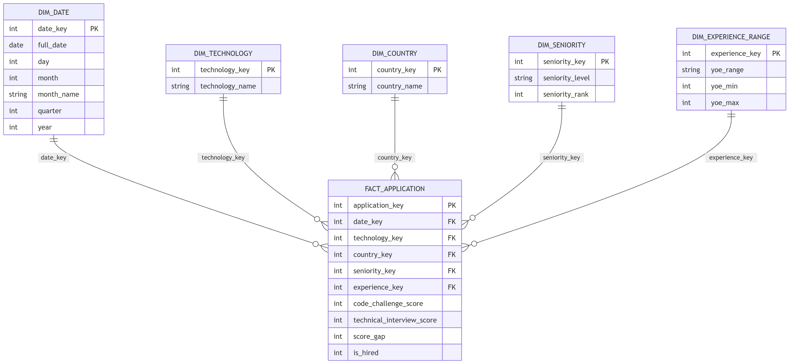
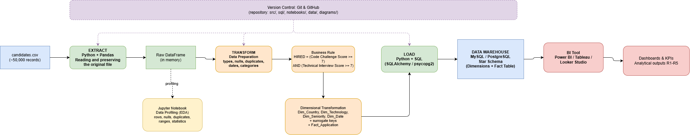

# Workshop 1: Recruitment Dimensional Data Warehouse

`Juan David Lasso Chaparro`

---

## 1. Project Objective

Design and implement a dimensional Data Warehouse that transforms raw candidate-application
data from a technology recruitment company into an analytical system capable of answering
five business questions about hiring patterns. The project follows the engineering workflow:

`Business Requirements → Data Understanding → Dimensional Modeling → ETL → Data Warehouse → Analytics → Business Decisions`

The goal is not simply to build a Data Warehouse, but to build an analytical data system that
satisfies concrete business requirements.

## 2. Business Context

A technology recruitment company wants to improve its understanding of its candidate selection
process. Candidates apply from many countries, at different seniority levels and years of
experience, for different technology profiles. Each candidate is evaluated through two
technical assessments, a **Code Challenge Score** and a **Technical Interview Score**, and is
considered **HIRED** when both scores are `>= 7`. Until now, this data only existed as raw
files; this project turns it into an analytical system that supports recruitment decisions.

## 3. Five Business Requirements

| ID | Business Requirement |
|---|---|
| R1 | Hiring Trends |
| R2 | Technology Analysis |
| R3 | Candidate Profile Analysis |
| R4 | Gap between Technical Assessments |
| R5 | Geographic Concentration of Candidates by Technology |

## 4. Requirements Traceability

| Requirement | Business Question | Data Required | Expected Analytical Output |
|---|---|---|---|
| R1 | How do applications and hires evolve over time (month/quarter/year)? | Application Date, Hired (derived) | Time series of applications vs. hires and hire rate over time |
| R2 | Which technologies generate the highest number and proportion of hired candidates? | Technology, Code Challenge Score, Technical Interview Score, Hired | Ranking of technologies by total hires and hire-rate percentage |
| R3 | How do hiring outcomes vary according to candidate seniority and years of experience? | Seniority, YOE, Hired | Hire rate broken down by seniority level and YOE range |
| R4 | Is there a significant difference in performance between the Code Challenge and the Technical Interview depending on the technology or seniority level? | Code Challenge Score, Technical Interview Score, Technology, Seniority | Comparison of average scores and the gap between both assessments, segmented by technology and seniority |
| R5 | Which technology profiles have their candidate pool highly concentrated in specific countries? | Technology, Country | Percentage share of each country within each technology's applicant pool; ranking of technologies by geographic concentration |

## 5. Dataset Description

- Source file: `candidates.csv` **~50,000 rows**, one row = one candidate application.
- Delimiter: `;`.
- Columns: `First Name`, `Last Name`, `Email`, `Country`, `Application Date`, `YOE`,
  `Seniority`, `Technology`, `Code Challenge Score`, `Technical Interview Score`.
- Business rule: `HIRED = Code Challenge Score >= 7 And Technical Interview Score >= 7`.

## 6. Main Profiling Findings

(Full detail in `notebooks/data_profiling.ipynb`)

- 50,000 rows, 10 columns, **no missing values** in any column.
- **No fully duplicated rows**, but **167 duplicated emails** some candidates applied more
  than once. This confirmed the grain must be "one application", not "one unique candidate".
- **244** unique countries and **24** unique technologies.
- `Seniority` has **7 levels**: Architect, Intern, Junior, Lead, Mid-Level, Senior, Trainee.
- `YOE` ranges from **0 to 30 years** (mean ≈ 15.3) and is statistically independent from
  `Seniority`.
- Both `Code Challenge Score` and `Technical Interview Score` range from **0 to 10**.
- Application dates range from **2018-01-01 to 2022-07-04**.
- Overall hire rate applying the business rule: **≈ 13.4%**.

## 7. Business Process

**Candidate application evaluation** within the technical recruitment/selection pipeline. All
five requirements analyze different angles (time, technology, candidate profile, assessment
consistency, geography) of the same underlying business event  a candidate's evaluated
application  so a single fact table at the application grain is sufficient. There was no need
for multiple business processes or fact tables.

## 8. Grain Definition

> **One row in `FACT_APPLICATION` represents one candidate's individual application to the
> technical recruitment process, including country and both assessment scores and the resulting hiring
> outcome for that specific application.**

## 9. Star Schema Diagram



## 10. Explanation of Dimensions and Facts

**Dimensions**

| Dimension | Purpose | Main Attributes | Requirement(s) |
|---|---|---|---|
| `DIM_DATE` | Temporal context of the application | date_key (PK), full_date, day, month, month_name, quarter, year | R1 |
| `DIM_TECHNOLOGY` | Technology profile applied for | technology_key (PK), technology_name | R2, R4, R5 |
| `DIM_COUNTRY` | Candidate's country | country_key (PK), country_name | R5 |
| `DIM_SENIORITY` | Declared seniority level | seniority_key (PK), seniority_level, seniority_rank | R3, R4 |
| `DIM_EXPERIENCE_RANGE` | Banded years of experience | experience_key (PK), yoe_range, yoe_min, yoe_max | R3 |

A **Candidate** dimension (First Name / Last Name / Email) was deliberately **not** created:
none of the five requirements need to group or analyze by individual identity, so it would be a
dimension without analytical purpose. `YOE` was converted from a continuous number into a
banded dimension attribute (`DIM_EXPERIENCE_RANGE`) instead of a fact measure, since it
describes the candidate's profile rather than an outcome of the evaluation event.

**Facts / Measures** (`FACT_APPLICATION`)

| Measure | Meaning | Source / Calculation | Requirement(s) |
|---|---|---|---|
| `code_challenge_score` | Code Challenge result (0-10) | Original column | R2, R4 |
| `technical_interview_score` | Technical Interview result (0-10) | Original column | R2, R4 |
| `score_gap` | Absolute gap between both assessments | `ABS(code_challenge_score - technical_interview_score)` | R4 |
| `is_hired` | Hiring outcome flag (1/0) | `1 if code_challenge_score>=7 AND technical_interview_score>=7 else 0` | R1, R2, R3 |
| *(applications count)* | Application volume | Implicit `COUNT(*)`  not a stored column | R1, R2, R3, R5 |

`code_challenge_score` and `technical_interview_score` are non-additive (averaged, never
summed); `is_hired` is fully additive (`SUM` = total hires, `AVG` = hire rate). Every dimension
uses a **surrogate key** generated during the ETL process  natural source values
(`technology_name`, `country_name`, etc.) are never used as primary keys.

## 11. ETL Architecture



## 12. Main Transformation Decisions

- The source file uses `;` as a delimiter, handled explicitly in `extract.py`.
- Data types corrected: `Application Date` → datetime, `YOE` and both scores → numeric.
- Categorical text columns (`Country`, `Seniority`, `Technology`) standardized with `strip()`.
- The 167 duplicated emails were **kept** due to the grain is "one application",
  so each row is a valid, independent record.
- `is_hired` and `score_gap` are the only derived columns created, both tied directly to a
  business requirement  no transformation without analytical purpose was added.
- `YOE` was banded into `DIM_EXPERIENCE_RANGE` instead of kept as a raw fact measure.
- Surrogate keys are generated sequentially in Python **before** loading, rather than relying
  on MySQL `AUTO_INCREMENT`, so keys are deterministic and reproducible across runs.

## 13. Technologies

- Python
- Pandas
- Jupyter Notebook
- SQL, MySQL (MySQL Workbench), SQLAlchemy + PyMySQL
- Git & GitHub
- Power BI

## 14. Instructions to Run the Project

**Prerequisites:** Python 3.10+, MySQL Server + MySQL Workbench, Power BI Desktop.

```bash
# 1. Clone the repository and enter it
git clone https://github.com/Bl4ck-Grimoire/Workshop-1
cd workshop-1

# 2. Create a virtual enviroment
python -m venv .venv
.venv\Scripts\activate

# Rename the file .env.example to only .env 
# Also configure your credentials
export MYSQL_USER=root
export MYSQL_PASSWORD=your_password
export MYSQL_HOST=127.0.0.1
export MYSQL_PORT=3306
export MYSQL_DATABASE=recruitment_dw

# 6. (Optional) Run the profiling notebook
# Open it on jupiter notebook, place the data source file and run it 

# 7. Run the project
python src/main.py
```

**Connecting the dashboard:**

1. Install the MySQL connector for Power BI (**MySQL Connector/NET**) before connecting.
2. In Power BI Desktop: *Get Data > More > Database > MySQL database* → enter the server and
   `recruitment_dw`, then your credentials. Select the 6 tables (`fact_application` + the 5
   dimensions) and click **Load**.
3. In *Model view*, verify the 5 relationships (dimension → fact, one-to-many, single direction).
4. Build one report page per requirement and save the `.pbix` file under `results/`.

## 15. Analytical Queries and KPIs

All queries run directly against the Data Warehouse:

| Requirement | KPI | Query summary |
|---|---|---|
| R1 | Applications, hires and hire rate by year/month | `fact_application` joined to `dim_date`, grouped by year/month |
| R2 | Total hires and hire rate by technology | `fact_application` joined to `dim_technology`, ranked by total hires |
| R3 | Hire rate by seniority × experience range | `fact_application` joined to `dim_seniority` and `dim_experience_range` |
| R4 | Average score gap by technology and seniority | `fact_application` joined to `dim_technology` and `dim_seniority`, using `score_gap` |
| R5 | Top-country concentration % per technology | CTE + window function over `fact_application`, `dim_technology`, `dim_country` |

## 16. Main Business Findings

- **R1:** Hire rate is stable between ≈12.7% and 14.1% from 2018 to 2022, with no clear upward
  or downward trend.
- **R2:** Hired-candidate counts by technology follow application volume; hire rate (≈13%-15%)
  is similar across all technologies, with no technology profile standing out.
- **R3:** Hire rate is nearly identical (≈12.7%-13.8%) across all 7 seniority levels and every
  experience band.
- **R4:** Average gap between both assessments is ≈3.5-3.8 points across every
  technology/seniority combination, with no outliers suggesting systematic inconsistency.
- **R5:** Maximum geographic concentration found is only ≈1% of any technology's candidate pool
  coming from a single country (out of 244 countries)  no real geographic dependency risk.

## 17. Final Requirements Validation

| Requirement | Implemented? | DW Tables Used | Query / KPI | Main Finding |
|---|---|---|---|---|
| R1 | Yes | fact_application, dim_date | Monthly/yearly hiring trend | Stable hire rate (~12.7%-14.1%) with no clear trend, 2018-2022 |
| R2 | Yes | fact_application, dim_technology | Hires and hire rate by technology | Hires proportional to volume; hire rate similar (~13%-15%) across technologies |
| R3 | Yes | fact_application, dim_seniority, dim_experience_range | Hire rate by seniority × YOE range | Hire rate nearly identical (~12.7%-13.8%) across all profiles |
| R4 | Yes | fact_application, dim_technology, dim_seniority | Average score gap by technology/seniority | Gap of ~3.5-3.8 points everywhere, no systematic inconsistency |
| R5 | Yes | fact_application, dim_technology, dim_country | Top-country concentration % by technology | Max concentration ~1%  no geographic dependency risk detected |

**Does the final Data Warehouse provide enough information to satisfy all five business
requirements?** Yes  all five were answered directly from the DW.

**Does the dimensional model contain elements that are not justified by the analytical
requirements?** No  every dimension and every measure is traceable to at least one requirement
(see Section 10).

**What business decisions can now be supported by the implemented analytical system?** With the
current data, no urgent action is required (no fraud risk or geographic dependency detected),
but the system is ready to flag these risks automatically as real production data accumulates.
